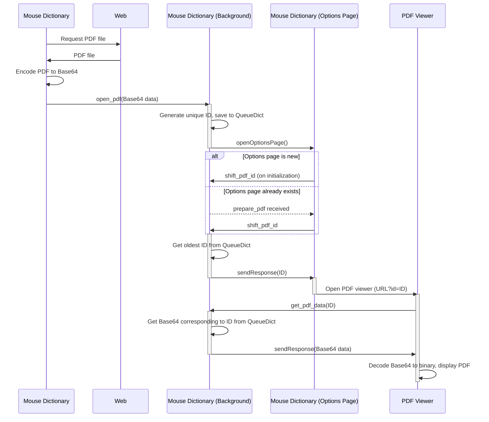

Place a PDF.js-based viewer here.

https://github.com/wtetsu/pdf.js

----

This sequence diagram illustrates how Mouse Dictionary displays a web-based PDF file within its built-in PDF viewer.  The complexity arises from the following limitations:

- The different parts of the extension (Main, Background, Options Page, PDF Viewer) can't directly share data with each other. They have to communicate by sending messages.
-  Because messages can only be text, the PDF is converted to Base64 (a text representation of the PDF) before being sent.

